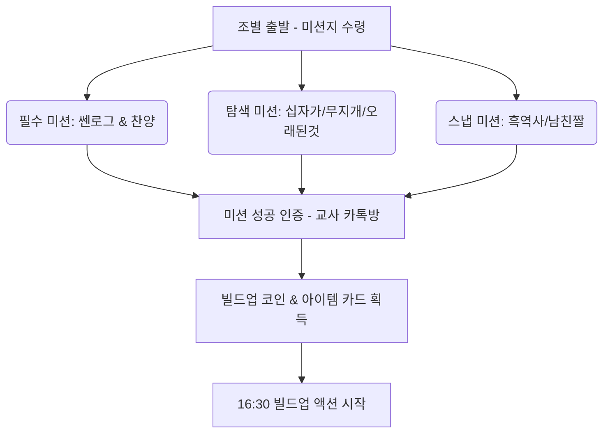

# 2026 중등부 여름 수련회 프로그램 기획안

이 기획안은 수련회 첫째 날 진행되는 **대전 은행동 씨티투어**와 대강당에서의 **Build Up Action** 프로그램을 유기적으로 연결하여, 학생들이 자연스럽게 몰입하고 공동체성을 다질 수 있도록 설계되었습니다.

---

## 💡 핵심 컨셉: "Build Up! 은행동에서 대강당까지"
* **연계 방식**: 은행동 씨티투어에서 조별 미션을 수행하여 **'빌드업 코인'**과 **'랜덤 아이템 카드'**를 획득합니다. 이 획득한 자산은 4시 반에 시작되는 **"대형 성경 브루마블 (Build Up Marble)"** 게임에서 결정적인 카드로 사용됩니다.
* **대상**: 중등부 학생 및 교사 (조별 진행)

---

## 1️⃣ [12:00 ~ 15:00] 대전 은행동 씨티투어: "코인 헌터스"

은행동의 지역적 특성(성심당, 스카이로드, 중앙시장 등)과 아이들의 아이디어를 결합한 미션형 로드 투어입니다.



### 📋 상세 미션 리스트 (미션 카드 양식)

| 미션 구분 | 미션 이름 | 미션 내용 및 방법 | 획득 보상 (코인/아이템) |
| :--- | :--- | :--- | :--- |
| **필수 미션** | **은행동 쎈로그 (Vlog)** | 은행동 거리(예: 스카이로드 아래)에서 조원 전체가 나오는 30초 분량의 조별 브이로그(쇼츠 형태) 촬영하기 (조장/조원의 소개와 오늘 수련회 다짐 포함) | 코인 3개 + 아이템 카드 1장 |
| **필수 미션** | **스트리트 찬양 파이터** | 은행동의 한적한 공간 혹은 지정된 장소에서 조원 전체가 모여 수련회 주제 찬양의 율동 및 찬양 한 소절을 완벽하게 소화해 영상으로 인증하기 | 코인 3개 + 아이템 카드 1장 |
| **탐색 미션** | **홀리 크로스 (십자가 찾기)** | 은행동 거리의 조형물, 간판, 나뭇가지 등에서 자연스럽게 만들어진 '십자가' 모양을 찾아 조원들의 손가락과 함께 사진 찍기 | 코인 1개 |
| **탐색 미션** | **레인보우 체이서** | 은행동 거리에서 빨, 주, 노, 초, 파, 남, 보 7가지 색상을 각각 가진 물건이나 간판을 찾아 한 장의 콜라주 사진으로 완성하기 | 코인 2개 |
| **탐색 미션** | **백투더 패스트 (유적 발굴)** | 중앙시장 혹은 은행동 골목에서 가장 오래되어 보이는 물건이나 건물(예: 대전천 목척교 옛 사진, 오래된 레트로 간판 등)을 찾아 사진을 찍고 그 이유를 간단히 적어 제출하기 | 코인 2개 |
| **초성 미션** | **은행동 자음 퀴즈** | 당일 제공되는 초성(예: `ㅅㅅㄷ` -> 성심당, `ㅅㅋㅇㄹㄷ` -> 스카이로드 등)의 장소나 물건을 찾아 조원 전체가 그 앞에서 조 포즈로 사진 촬영하기 | 코인 1개 (개당) |
| **스냅 미션** | **레전드 짤 메이커** | 친구의 '남친짤/여친짤' 1장과 세상에서 가장 웃긴 '흑역사 짤' 1장을 촬영하여 전송 (단, 당사자 동의 필수! 웃음 점수 반영) | 코인 2개 |
| **마니또 미션** | **비밀의 선물** | 은행동 문구점이나 소품샵 등에서 조별 예산(예: 인당 2,000원) 내에서 자신의 마니또에게 줄 깜짝 선물을 사고 영수증 인증하기 | 코인 1개 |

> [!NOTE]
> * **안전 수칙**: 은행동은 인파가 많으므로 무단횡단 금지, 대열 이탈 금지 등의 안전 규칙을 사전에 명확히 공지해야 합니다.
> * **인증 방식**: 조별 오픈채팅방을 개설하여 미션 성공 사진/영상을 업로드하면 프로그램 스태프가 확인 후 실시간으로 코인을 적립해 줍니다.

---

## 2️⃣ [16:30 ~ 18:00] Build Up Action: "성경 빌드업 마블"

대강당 바닥에 대형 라인 테이프로 브루마블 판을 부착하고, 조별로 인간 말이 되어 주사위를 던져 판을 돌며 땅(성경 속 지명)을 사고 빌딩을 짓는 게임입니다.

```
[시작점] ─── Eden ─── Ararat ─── [감옥:광야]
   │                                   │
Babylon                             Red Sea
   │                                   │
 [황금카드]                           Sinai
   │                                   │
Bethlehem ── Jericho ── Jerusalem ─── [골인/천국]
```

### 🎲 게임 진행 방식
1. **말 이동**: 조 대표가 대형 주사위를 던져 나온 수만큼 이동합니다.
2. **미션 수행 (인수/건설)**: 도착한 칸의 성경 속 지명을 획득하려면 그 칸에 배정된 **'액션 미션'**이나 **'성경/찬양 퀴즈'**를 통과해야 합니다.
3. **자원 활용**:
   * **씨티투어 코인**: 퀴즈 힌트를 사거나, 액션 미션 재도전 기회를 구매하는 데 사용됩니다.
   * **아이템 카드**: 상대방 조 통행료 면제(실드), 통행료 2배(더블), 퀴즈 강제 패스 등의 카드로 반전의 재미를 줍니다.

### 🎭 브루마블 칸별 미션 구성 (아이들 아이디어 반영)

#### 📝 [유형 A] 성경 & 찬양 미션 (지적 빌드업)
* **초성 성경 키워드 퀴즈 (Eden, Sinai 칸)**:
  * 예: 키워드 `ㅁㅅ`, `ㅅㄴㅅ`, `십계명` -> 출애굽기 모세의 시내산 사건 맞추기. 성경 구절의 빈칸에 들어갈 단어 맞추기.
* **찬송가 맞추기 / 이어 부르기 (Jericho, Bethlehem 칸)**:
  * 찬양의 전주 3초만 듣고 제목 맞추기.
  * 찬양 한 소절을 부르면 다음 조원이 이어서 박자와 음정을 맞춰 이어 부르기.

#### 🏃‍♂️ [유형 B] 액션 & 스포츠 미션 (신체적 빌드업)
* **스탑 피구 (Red Sea 칸)**:
  * 수비 조가 원 안에 서고, 공격 조가 원 밖에서 피구공을 던집니다. 주사위 눈금에 따라 수비 조는 움직일 수 없거나 한 발만 뗄 수 있는 패널티를 안고 버티는 생존 게임. (제한 시간 2분 동안 몇 명 생존하는가에 따라 인수 결정)
* **미션 이어달리기 (Babylon 칸)**:
  * 코끼리 코 5바퀴 돌고 신발 던져서 과녁에 넣기 -> 2인 3각 달리기 -> 단체 줄넘기 5회 등 조원 전체가 릴레이로 미션을 수행하는 스피드전.
* **빅 발리볼 랠리 (Jerusalem 칸)**:
  * 지름 1m 크기의 대형 풍선/빅 볼을 이용해 조원들이 협동하여 땅에 떨어뜨리지 않고 15회 이상 패스/랠리 성공하기.

#### 🃏 [유형 C] 황금열쇠 및 특수 칸
* **황금열쇠 (찬스)**:
  * "오래된 물건 인증": 씨티투어에서 가장 오래된 물건을 찾은 조에게 통행료 면제권 지급.
  * "흑역사 방출": 씨티투어에서 찍은 친구의 흑역사 사진 중 베스트를 단체 톡방에 공개하고 큰 웃음을 주면 코인 3개 추가 획득.
  * "마니또의 축복": 마니또 선물을 가장 정성스럽게 고른 조에게 주사위 한 번 더 던질 기회 부여.

---

---

## 3️⃣ [대안 기획] Build Up Action: 플랜 B & C

메인 프로그램인 '성경 빌드업 마블(Plan A)'의 준비 상황이나 기상 및 장소 여건에 따라 선택하여 진행할 수 있는 대안 플랜입니다.

### 📝 [플랜 B] 정적인 컨셉: "Build Up! 브레인 서바이벌"
대형 게임판 설치나 몸을 쓰는 큰 움직임 없이, 조별 자리에 앉아 빔 프로젝터와 화이트보드를 활용해 퀴즈와 찬양으로 대결하는 실내 지식 게임입니다.

* **1단계: 성경 키워드 골든벨 (성경 구절 맞추기)**
  * 화면에 특정 성경 구절의 핵심 키워드(또는 빈칸/초성)가 단서로 제공됩니다.
  * 조원들이 협동하여 소형 화이트보드(스케치북)에 정답 구절이나 핵심 메시지를 적어 동시에 들어 올립니다.
  * **씨티투어 연계**: 씨티투어에서 획득한 '코인'을 지불하여 힌트(성경 장/절, 글자 수 등)를 구매할 수 있습니다.
* **2단계: 찬송가 이어 부르기 대결**
  * 스태프가 찬양/찬송가의 전주를 3초간 들려주면 조별로 제목을 맞춥니다.
  * 제목을 맞춘 조는 마이크를 잡고 조원들이 한 소절씩 끊김 없이 이어서 노래를 불러야 점수를 획득합니다 (중간에 박자/음정/가사가 틀리면 다른 조로 기회가 넘어감).
* **3단계: 흑역사 명예의 전당 (사진 투표)**
  * 씨티투어 시간 동안 단체 톡방에 접수된 아이들의 '흑역사 짤'과 '남친/여친 스냅'을 화면에 띄웁니다.
  * 실시간 모바일 투표나 스태프 심사를 통해 가장 큰 웃음과 감동을 준 사진을 선정하고 해당 조에 보너스 점수(또는 찬스 아이템)를 부여합니다.

---

### 🏃 [플랜 C] 활동적인 컨셉: "Build Up! 스포츠 올림픽"
정밀한 룰셋이나 대형 보드판 없이, 넓은 강당 공간을 그대로 활용하여 직관적인 팀 대결과 체육 활동으로 에너지를 발산하는 미니 운동회입니다.

* **1경기: 스탑 피구 (변칙 피구 게임)**
  * 기본 피구 규칙에 재미 요소를 더한 게임입니다.
  * 스태프가 호루라기를 불어 **"스탑!"**을 외치면 모든 선수는 제자리에 멈춰야 합니다. 이때 공을 가진 선수만 움직이지 않고 상대편을 맞출 수 있으며, 수비수는 제자리에서 몸만 움직여 공을 피해야 합니다.
  * **씨티투어 연계**: 씨티투어에서 획득한 '아이템 카드'를 사용해 아웃된 조원을 즉시 부활(부활 카드)시키거나, 공을 한 번 막아낼(실드 카드) 수 있습니다.
* **2경기: 빅 발리볼 랠리 (협동 패스)**
  * 지름 1m 내외의 커다란 풍선공이나 빅 볼을 사용합니다.
  * 조원 전체가 손이나 몸을 사용하여 공을 바닥에 떨어뜨리지 않고 15회 이상 연속으로 패스(랠리)하는 협동 대결입니다. (가장 랠리 횟수가 높은 조가 승리)
* **3경기: 미션 이어달리기 & 신발 던지기**
  * 조원 전체가 바통을 이어받으며 달리는 미션 릴레이입니다.
  * 각 주자는 코끼리 코 5바퀴 돌기, 2인 3각 달리기 등의 코스를 통과합니다.
  * 마지막 주자는 피니시 라인에 서서 신발을 발로 차서 대형 바구니나 표적판 매트 위에 정확히 안착시켜야 최종 골인으로 인정됩니다.

---

## 4️⃣ 프로그램 준비 및 운영 체크리스트 (종합)

### 🛠️ 필요 물품 (준비물)

| 구분 | **플랜 A: 빌드업 마블** | **플랜 B: 브레인 서바이벌 (정적)** | **플랜 C: 스포츠 올림픽 (동적)** |
| :--- | :--- | :--- | :--- |
| **공통** | 조별 미션 카드, 볼펜, 조별 단체 조끼/명찰, 마니또 선물용 조별 예산 봉투 |
| **개별 준비물** | • 바닥 라인 테이프<br>• 우드락 지명 판넬<br>• 대형 스펀지 주사위 (2개)<br>• 피구공, 빅 발리볼<br>• 신발 던지기용 표적판 | • PPT 퀴즈 화면 (노트북/프로젝터)<br>• 조별 소형 화이트보드, 마커, 지우개<br>• 무선 마이크, 음향 장비<br>• 흑역사 사진 투표용 오픈채팅방 | • 체육관 라인 테이프, 호루라기<br>• 피구공<br>• 빅 발리볼용 대형 공<br>• 신발 던지기용 바구니/표적판<br>• 초시계 (타이머) |

### ⏱️ 첫날 타임라인 (플랜 공통)

| 시간 | 프로그램 내용 | 장소 | 비고 |
| :--- | :--- | :--- | :--- |
| **12:00 ~ 12:15** | 씨티투어 오리엔테이션 및 미션 카드 배부 | 대전역 혹은 지정 장소 | 조별 예산 및 안전 교육 |
| **12:15 ~ 15:00** | **대전 은행동 씨티투어 미션** | 은행동 일대 | 실시간 카톡 인증 및 코인 적립 |
| **15:00 ~ 16:30** | 수련회장 이동 및 방 배정, 휴식 | 수련회장 대강당/숙소 | 스태프 프로그램 세팅 완료 시간 |
| **16:30 ~ 16:40** | Build Up Action 오리엔테이션 & 자산 환산 | 대강당 | 획득한 코인/아이템 카드 확인 및 규칙 공지 |
| **16:40 ~ 17:50** | **Build Up Action 본 프로그램 진행** | 대강당 | **선택된 플랜(A, B, C 중 택1) 진행** |
| **17:50 ~ 18:00** | 시상식 및 마무리, 저녁 식사 안내 | 대강당 | 우수 조 상품 증정 |


