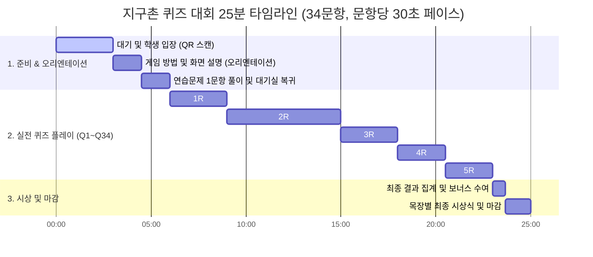

# ⏱️ 지구촌 퀴즈 대회 25분 현장 진행 큐시트 (Cue Sheet)

본 큐시트는 **[quiz_202606.csv](file:///Users/seungkyulee/Projects/jiguchon/emoticon_quiz/quiz_202606.csv)**의 상위 **34문항** 구성과 새로 추가된 **게임 오리엔테이션**, 그리고 **문제 출제 및 답변 통합 15초 제한 시간** + **정답 공개 및 설명 15초** 흐름에 정확히 맞추어 기획된 25분 현장 운영 매뉴얼입니다.

---

## 📌 진행 개요
*   **전체 제한 시간:** 25분 (1,500초)
*   **한 문제당 시간 제한:** **15초** (문제 출제 + 힌트 확인 + 답변 입력 통합 타이머)
*   **정답 공개 및 설명 시간:** **15초** (진행자 보충 해설 및 스크린 리액션 반응용)
*   **평균 문항 순환 주기:** **30초** (15초 답변 입력 + 15초 정답 공개/해설 및 다음 문항 이동)
*   **게임 모드:** 팀전 (목장별 대항전 - 상위 3명 합산제)
*   **주요 장치 세팅:**
    *   **진행자 메인 스크린 (Host):** 대형 빔 프로젝터 화면 띄우기 (입장 QR, 오리엔테이션 슬라이드, 퀴즈 문제, 실시간 등수 그래프 노출)
    *   **진행자 스마트폰 (Remote):** 모바일 리모컨 접속 (`/#/monitor?pin=XXXX`)
    *   **학생 스마트폰 (Client):** 주소 접속 및 닉네임/소속 목장 가입 후 실시간 정답 입력

---

## 🎯 핵심 규칙 및 시스템 스펙

### 📋 진행 및 제출 규칙
*   **오리엔테이션 (3분):** 퀴즈 시작 전 전광판 화면에 설명 및 스마트폰 목업(주관식/객관식 예시)을 띄우고 규칙을 설명한 뒤, 실제 1개의 연습문제(`🍎🍊🍌` = `과일`)를 풀어보고 대기실로 복귀하는 훈련 단계입니다.
*   **15초 통합 제한 시간:** 별도의 문제 출제/설명 시간 없이 **문제가 화면에 노출됨과 동시에 15초 타이머가 카운트다운**됩니다. 종료 5초 이하 시 학생 폰에 **경고 진동 및 비프음** 피드백이 전송됩니다.
*   **자동 제출 시스템:** 타이머가 0초가 되는 순간, **입력창에 쓰던 답이 서버로 즉시 자동 전송**됩니다.
*   **답안 수정 가능:** 타이머가 흐르고 있는 15초 동안은 언제든 답안을 고치고 재전송할 수 있습니다.

### 🏆 점수 및 보너스 시스템
*   **목장별 상위 3명 합산제:** 목장 간 학생 수 불균형을 해결하기 위해, 목장 내 점수가 가장 높은 상위 3명의 누적 점수 합계로 목장 랭킹이 결정됩니다.
*   **동점 공동 순위(Tied Rank):** 퀴즈 점수가 완전히 동점인 경우 같은 순위를 부여하며, 시상대(Podium)에 왕관을 쓴 캐릭터들이 나란히 올라가는 입체 연출이 진행됩니다.
*   **실시간 보너스 가산점 (+15점):** 게임 종료 후 리모컨을 통해 최다 접속 / 최소 접속 / 동반성장(표준편차 최저) / 평균 최속 제출 목장에 일괄 가산점을 부여할 수 있습니다.

---

## ⏱️ 단계별 전체 타임라인 (총 25분)

---

## 📋 세부 진행 시나리오

| 시간 | 활동 | 진행자 멘트 및 핵심 리액션 가이드 (간략본) |
| :--- | :---: | :--- |
| **00:00 ~ 03:00** (3.0분) | **오프닝 & 목장 입장** | 📢 **"스마트폰을 꺼내 스크린의 QR 코드를 스캔하세요! 목장을 정확히 선택해야 점수가 합산됩니다!"** - *"개인전뿐 아니라 목장 대항전입니다. 서둘러 접속해 주세요!"* |
| **03:00 ~ 04:30** (1.5분) | **게임 방법 및 화면 설명** | 📢 **"화면에 가상 폰이 보이시죠? 주관식은 띄어쓰기 없이 입력하고, 객관식은 카드 네 개 중 하나를 골라 터치하세요."** - *"15초 동안은 언제든 답을 수정해 다시 전송할 수 있습니다."* |
| **04:30 ~ 06:00** (1.5분) | **연습문제 풀이 및 로비 복귀** | 📢 **"실제 한 문제 같이 풀어봅니다. 🍎🍊🍌 힌트 보시고 정답을 적어보세요. 15, 14... 3, 2, 1 마감!"** - *"정답은 과일! 연습 점수는 들어가지 않습니다. 이제 대기실로 깨끗이 복구하여 실전 갑니다!"* |
| **06:00 ~ 09:00** (3.0분) | **1R: 아이스브레이킹 (Q1 ~ Q6)** *(문항당 30초)* | 📢 **"실전 돌입! Q1~Q6은 10점짜리 몸풀기 문제입니다. 속도가 생명이에요!"** - *문제 노출 즉시 15초 타이머 시작. 정답 공개 후 15초간 간단 리액션하며 다음 문제로 템포 유지.* |
| **09:00 ~ 15:00** (6.0분) | **2R: 성경 인물 & 기적 (Q7 ~ Q18)** *(문항당 30초)* | 📢 **"자, 성경 인물과 사건 기적 라운드입니다. 주관식 인물 문제는 20점으로 배점이 큽니다!"** - *마리아, 요셉, 삭개오, 베드로, 동방박사, 가룟유다 등 이모티콘 힌트 가이드를 보며 30초 템포 중계.* |
| **15:00 ~ 18:00** (3.0분) | **3R: 스포츠 & 대중문화 (Q19 ~ Q24)** *(문항당 30초)* | 📢 **"3라운드는 축구와 연예/K-pop이 반씩 섞인 상식 라운드입니다. 양보 없이 가야 합니다!"** - *남학생을 위한 오프사이드/해트트릭/메시와 여학생을 위한 그룹 리더/만능인/청룡영화상 상식 중계.* |
| **18:00 ~ 20:30** (2.5분) | **4R: 말씀 & 비유 (Q25 ~ Q29)** *(문항당 30초)* | 📢 **"비유 문제들이 집중 출제되는 4라운드입니다. 보기 카드를 신중하게 보고 선택하세요!"** - *씨 뿌리는 자, 겨자씨, 탕자, 사마리아인, 달란트 등 성경 속 비유 문제의 의미를 정답 노출 시 간략 설명.* |
| **20:30 ~ 23:00** (2.5분) | **5R: 파이널 성경 장소 (Q30 ~ Q34)** *(문항당 30초)* | 📢 **"마지막 5라운드 성경 장소 5문제! 주관식 25점, 마지막 갈릴리는 30점 대역전 찬스!"** - *나사렛, 베들레헴, 겟세마네, 골고다, 갈릴리 등 성경 속 사건 장소의 결정적 힌트를 즉각 제공.* |
| **23:00 ~ 25:00** (2.0분) | **자동 보너스 적용 & 최종 시상식** | 📢 **"모든 문제가 종료되었습니다! 이제 최종 목장 순위를 정산합니다."** - *리모컨 보너스 4종(최다 접속, 스피드왕 등) 수동 클릭 적용 후, 빔 프로젝터 3D 시상대 발표.* |

---

## 📖 라운드별 전체 문제 & 정답 및 진행자 힌트 표

| 번호 | 유형 | 문제 (이모티콘 또는 질문 텍스트) | 정답 | 진행자 현장 힌트 가이드 |
| :---: | :---: | :--- | :--- | :--- |
| **Q1** | 주관식 | 🇰🇷⚽7️⃣📸 | **손흥민** | 대한민국 축구 대표팀 주장이자 토트넘의 캡틴! 찰칵📸 세리머니의 주인공은? |
| **Q2** | 주관식 | 🧨🧈🎤7️⃣ | **방탄소년단** | 다이너마이트(🧨)와 버터(🧈)로 빌보드를 정복한 전 세계 1위 7인조 보이 그룹! |
| **Q3** | 주관식 | 뉴진스, 세븐틴 등이 속해 있는 대형 엔터사 이름은? | **하이브** | 뉴진스, 세븐틴, 투모로우바이투게더 등이 속해 있는 대표 K-POP 대형 기획사! |
| **Q4** | 주관식 | 전 세계에서 가장 큰 동영상 공유 플랫폼 이름은? | **유튜브** | 전 세계 사람들이 가장 많이 시청하는 대표적인 동영상 공유 서비스 사이트! |
| **Q5** | 주관식 | 📺🎬🎵💿 | **OST** | 드라마(📺)나 영화(🎬)의 감동을 더해주는 오리지널 사운드 트랙의 영문 약자 3글자! |
| **Q6** | 주관식 | 정식 공개 전 기대감을 높이기 위해 공개하는 홍보 영상은? | **티저** | 팬들의 호기심과 기대감을 유발하기 위해 처음에 짧게 보여주는 예고 홍보 영상! |
| **Q7** | 주관식 | 🤱⭐👼 | **마리아** | 천사(`👼`)의 수태고지와 동방박사를 인도한 별(`⭐`) 아래, 아기 예수를 안고(`🤱`) 계신 분! |
| **Q8** | 주관식 | 🧔🪵🔨👨‍👦✝️ | **요셉** | 예수님(`✝️`)의 육신의 아버지이자 성경 속 목수(`🪵🔨`)로 일했던 이 인물은? |
| **Q9** | 주관식 | 🌳🧔🤏👀💰 | **삭개오** | 키가 작아 뽕나무(`🌳`) 위로 올라가 예수님을 보았던 여리고의 부유한(`💰`) 세리장! |
| **Q10** | 주관식 | 🔑🐟⛵🧔🎣 | **베드로** | 갈릴리 어부(`🐟⛵🎣`) 출신이자 예수님께 천국 열쇠(`🔑`)를 선물받은 수제자! |
| **Q11** | 주관식 | 🎓🎓🎓🌠🎁 | **동방박사** | 하늘의 별(`🌠`)을 연구하다 아기 예수께 귀한 예물(`🎁`)을 전해드린 3인의 학자들! |
| **Q12** | 객관식 | 🍞🍞🍞🍞🍞🐟🐟 | **오병이어의 기적** | 보리떡 다섯 개와 물고기 두 개로 5천 명을 배불리 먹이신 대표적인 기적 사건! |
| **Q13** | 객관식 | 🤵👰🏺💧🍷 | **가나의 혼인잔치** | 예수님께서 첫 번째 기적으로 항아리의 물(`💧`)을 극상품 포도주(`🍷`)로 바꾸신 장소! |
| **Q14** | 객관식 | 🌊🚶🧔⛵ | **물 위를 걸으심** | 깊은 밤 풍랑으로 괴로워하는 제자들에게 예수님이 바다(`🌊`) 위를 걸어오신 사건! |
| **Q15** | 주관식 | 🧔3️⃣0️⃣🪙💋 | **가룟유다** | 은 30냥(`3️⃣0️⃣🪙`)과 거짓 입맞춤(`💋`)으로 스승이신 예수님을 팔아넘긴 제자! |
| **Q16** | 객관식 | 🍞🍷🍇🧔 | **최후의 만찬** | 십자가 사건 전날 밤, 예수님이 제자들과 떡과 포도주(`🍞🍷`)를 나누신 마지막 식사! |
| **Q17** | 객관식 | ✝️🔨🩸😭 | **십자가 사건** | 인류의 모든 죄를 짊어지시고 예수님께서 못(`🔨`) 박혀 피(`🩸`) 흘려 돌가신 사건! |
| **Q18** | 객관식 | ✝️🪨🚪🔓✨ | **예수님의 부활** | 무덤을 막았던 큰 돌문(`🪨🚪`)을 열고, 사망 권세를 이겨 사흘 만에 다시 사신 사건! |
| **Q19** | 객관식 | ⚽🏃🏁🚫 | **오프사이드** | 패스하는 순간에 공격수가 상대 최종 수비수보다 골라인에 더 가까이 가 있을 때의 반칙! |
| **Q20** | 주관식 | 🎩⚽⚽⚽3️⃣✨ | **해트트릭** | 한 선수가 한 경기에서 혼자서 총 3골(`⚽⚽⚽3️⃣`)을 기록하는 엄청난 득점 기록! |
| **Q21** | 주관식 | 🇦🇷⚽🐐👑 | **메시** | 아르헨티나의 월드컵 영웅이자 축구 역사상 최고의 신(GOAT`🐐`)이라 불리는 축구 황제! |
| **Q22** | 주관식 | K-POP 그룹에서 공식 인사를 하고 팀을 이끄는 역할은? | **리더** | 아이돌 그룹에서 대표로 인터뷰를 조율하고 멤버들을 하나로 묶어 이끄는 중요한 중심 역할! |
| **Q23** | 주관식 | 노래·춤·연기·예능 다방면에서 활약하는 만능 방송인은? | **만능엔터테이너** | 가창력, 댄스, 연기력과 뛰어난 예능감까지 고루 갖춘 올라운더 연예인을 일컫는 말! |
| **Q24** | 주관식 | 🔵🐉🎬🏆 | **청룡영화상** | 매년 말 청색 용(`🔵🐉`) 문양이 있는 트로피를 시상하는 대한민국 대표 영화제! |
| **Q25** | 객관식 | 🫳🪨🌿🌾 | **씨 뿌리는 자의 비유** | 씨를 뿌렸을 때 길가, 돌짝밭(`🪨`), 가시덤불(`🌿`), 좋은 땅(`🌾`)에 떨어진 성경 속 비유! |
| **Q26** | 객관식 | 🤏⚫🌱🌳 | **겨자씨 비유** | 눈에 보이지 않을 만큼 미세한 아주 작은 씨앗(`🤏⚫`)이 자라 큰 나무(`🌳`)가 되는 비유! |
| **Q27** | 객관식 | 🧔🚶🐖🏠❤️ | **돌아온 탕자 비유** | 유산을 탕진하고 돼지 우리(`🐖`)에서 뉘우친 후, 아버지 품(`🏠❤️`)으로 돌아온 아들의 비유! |
| **Q28** | 객관식 | 🩹🤕🐴❤️ | **선한 사마리아인 비유** | 강도를 만나 다친 사람(`🩹🤕`)을 외면하지 않고 치료해 나귀(`🐴`)에 태워 살려준 이웃! |
| **Q29** | 객관식 | 🪙🪙🪙🧔 | **달란트 비유** | 주인이 먼 길을 가면서 종들의 능력에 맞춰 금화(`🪙`)를 다섯, 둘, 하나씩 준 비유! |
| **Q30** | 주관식 | 🛠️👦🧔🏘️ | **나사렛** | 예수님께서 어린 시절 요셉을 도와 목수 일(`🛠️`)을 배우며 자라나신 소박한 고향 마을! |
| **Q31** | 주관식 | ⭐🏘️👼👶🐮 | **베들레헴** | 호적을 하러 가던 요셉과 마리아가 아기 예수(`👶`)를 구유에 뉘어 낳으신 영광의 탄생지! |
| **Q32** | 주관식 | 🌃🌳🧔🙏 | **겟세마네** | 예수님께서 십자가에 달리시기 전날 밤 땀방울이 피가 되도록 엎드려 기도하셨던 동산! |
| **Q33** | 주관식 | 💀⛰️✝️ | **골고다** | '해골의 곳'이라는 무시무시한 의미를 가졌으며, 인류를 구원하기 위해 십자가를 세운 언덕! |
| **Q34** | 주관식 | 어부인 베드로를 부르고 물 위를 걷는 기적의 호수는? | **갈릴리** | 예수님의 수많은 이적과 어부 베드로, 안드레를 사람 낚는 어부로 부르신 성경 속 호수 바다! |
